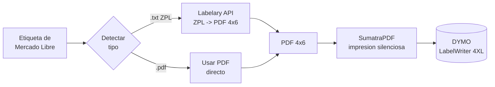

[README.md](https://github.com/user-attachments/files/29523087/README.md)
# 🏷️ Etiquetas ML → DYMO 4XL

**Automatización de impresión de etiquetas de envío de Mercado Libre en impresoras DYMO LabelWriter 4XL.**

App de escritorio que convierte etiquetas en formato ZPL (`.txt`) o PDF al formato 4×6" e
imprime por lote, eliminando un proceso manual repetitivo en la operación de e-commerce.

> Proyecto de automatización operativa — Ingeniería Industrial · Operaciones · Mejora de procesos

---

## 🎯 El problema (contexto operativo)

En la operación de envíos de Mercado Libre, la plataforma entrega la guía de paquetería en
formato **`.txt` (ZPL, lenguaje de impresoras Zebra)** o **PDF tamaño carta**. La impresora
disponible es una **DYMO LabelWriter 4XL**, que **no interpreta ZPL** y cuyo software nativo
solo abre archivos `.label`/`.labelx`.

El resultado era un **cuello de botella** en el flujo de despacho:

- Cada etiqueta se procesaba **manualmente, una por una**.
- Formato incompatible → reintentos, etiquetas cortadas y **códigos de barras ilegibles**.
- Conocimiento dependiente de una sola persona (sin proceso estandarizado).

Desperdicios identificados (Lean): **espera, sobreprocesamiento, retrabajo y movimiento**.

---

## 💡 La solución

Una aplicación de escritorio con interfaz simple que **estandariza y automatiza** el proceso
de impresión, pensada para cero fricción en piso:

1. El usuario selecciona los archivos (o una carpeta completa).
2. La app **detecta automáticamente** el tipo de cada archivo (ZPL / PDF).
3. Convierte el ZPL a un **PDF 4×6"** con la densidad correcta.
4. Lo **envía a imprimir por lote** a la DYMO, en silencio, con un solo botón.

---

## 📊 Impacto / resultados

> ⚠️ **Reemplaza estos valores con tu medición real.** Son la parte más importante para
> demostrar el valor del proyecto como Ingeniero Industrial.

| Métrica | Antes (manual) | Después (app) | Mejora |
|---|---|---|---|
| Tiempo por etiqueta | `[__ s]` | `[__ s]` | `[__ %]` |
| Etiquetas por lote | 1 a la vez | N por clic | — |
| Reimpresiones por error | `[__ %]` | `[__ %]` | `[__ %]` |
| Tiempo total / día | `[__ min]` | `[__ min]` | `[__ h/mes ahorradas]` |
| Personas capaces de operarlo | 1 | Cualquiera del equipo | Proceso estandarizado |

**Cómo medirlo:** cronometra 10 etiquetas con el método anterior y 10 con la app; saca el
promedio y multiplícalo por tu volumen diario. (Marca cualquier estimado como *estimado*.)

---

## 🔄 Cómo funciona

| Etapa | Tecnología | Rol |
|---|---|---|
| Detección de formato | Python (lectura de cabecera del archivo) | Distingue ZPL / PDF |
| Conversión ZPL → PDF | [Labelary API](http://labelary.com/) | Renderiza el ZPL a PDF 4×6" |
| Impresión silenciosa | [SumatraPDF](https://www.sumatrapdfreader.org) CLI | Envía el PDF a la DYMO sin diálogos |
| Interfaz | Tkinter (librería estándar) | GUI sin instalar dependencias |

---

## ✨ Características

- **Detección automática** de ZPL vs PDF (no hay que elegir formato).
- **Procesamiento por lote**: una carpeta completa con un clic.
- **Densidad configurable** (8/12/6/24 dpmm) para distintos diseños de etiqueta.
- **Tamaño configurable** (por defecto 4×6").
- **Modo "solo convertir"**: genera los PDF sin imprimir.
- **Registro en vivo** del resultado de cada archivo.
- **Recuerda la configuración** (impresora, densidad, última carpeta).
- **Sin dependencias de pip** — solo la librería estándar de Python.

---

## 🚀 Instalación y uso

### Requisitos
- **Windows 10/11**
- **Python 3.8+** → https://www.python.org/downloads/ (marca *"Add Python to PATH"*)
- **SumatraPDF** (gratis) → https://www.sumatrapdfreader.org
- Conexión a internet (para la conversión ZPL vía Labelary)
- Impresora **DYMO LabelWriter 4XL** con rollo 4×6" (ref. DYMO **1744907**)

### Uso
1. Doble clic en **`INICIAR_App.bat`** (o `py src/EtiquetasML_DYMO.py`).
2. Verifica el nombre de la impresora y la densidad (8dpmm es lo común en ML).
3. **Seleccionar archivos** o **Seleccionar carpeta**.
4. **CONVERTIR E IMPRIMIR TODO**.

> **Configuración del driver (una vez por equipo):** clic derecho en la DYMO → Preferencias
> de impresión → tamaño de papel **4 in × 6 in** → predeterminada.

---

## 📦 Generar ejecutable (.exe)

Para distribuirlo sin pedir Python instalado, ver **[BUILD_EXE.md](BUILD_EXE.md)**.

---

## ⚠️ Limitaciones y mejoras futuras

- **Depende de Labelary** (servicio en línea) → requiere internet y el contenido del ZPL
  se envía a ese servicio. *Mejora:* renderizado ZPL offline.
- **Sin pruebas automatizadas** todavía. *Mejora:* tests de la capa de detección/conversión.
- **Asume etiqueta 4×6 / portrait.** *Mejora:* perfiles por tipo de etiqueta.
- *Mejora:* modo "vigilar carpeta de Descargas" para impresión automática al descargar.
- *Mejora:* tablero de métricas (etiquetas/día, errores) exportable a Power BI.

---

## 🧰 Stack

`Python` · `Tkinter` · `Labelary API` · `SumatraPDF` · `ZPL` · `Windows`

---

## 👤 Autor

**Carlos G. Dumas** — Estudiante de Ingeniería Industrial, Tecnológico de Monterrey.
Operaciones · Manufactura · Mejora de procesos · Automatización operativa.

## 📄 Licencia

MIT — ver [LICENSE](LICENSE).
