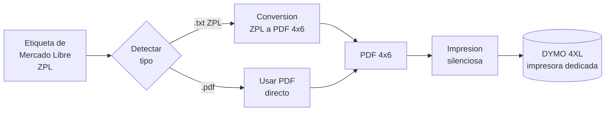

[README.md](https://github.com/user-attachments/files/29524623/README.md)
# 🏷️ Etiquetas ML → DYMO 4XL

**Automatización de impresión de etiquetas de envío de Mercado Libre en impresoras DYMO LabelWriter 4XL.**

Aplicación de escritorio que detecta y convierte automáticamente las guías en formato ZPL
(`.txt`) al formato correcto 4×6", para que cualquier persona del equipo pueda imprimir
etiquetas con un clic, sin conocimiento técnico y sin arriesgar la impresora de oficina.

> Proyecto de automatización operativa. Ingeniería Industrial, operaciones y mejora de procesos.

---

## 🎯 El problema

No era un problema de tiempo, era de **accesibilidad y riesgo al hardware**.

Mercado Libre entrega las guías de envío en **ZPL** (lenguaje de impresoras Zebra). La
impresora **DYMO LabelWriter 4XL no interpreta ese formato**, así que la etiqueta
simplemente no se podía imprimir. La tarea dependía de conocimiento técnico que no todos
en el equipo tenían.

Como solución provisional, se intentaba imprimir etiquetas adhesivas en la **impresora HP
de oficina**, que no está hecha para adhesivos, poniendo en riesgo de daño a ese equipo.

En resumen, había tres problemas:

| Problema | Descripción |
|---|---|
| **Formato incompatible** | El ZPL de Mercado Libre no lo lee la DYMO; la etiqueta no salía. |
| **Riesgo al hardware** | El workaround con adhesivos arriesgaba dañar la impresora HP de oficina. |
| **Dependencia de una persona** | Solo quien tenía el conocimiento técnico podía resolverlo. |

---

## 💡 La solución

Una aplicación de escritorio ligera (Python, sin dependencias pesadas) que automatiza el
flujo completo y deja la decisión de formato en manos del software, no del operador.

1. El usuario selecciona los archivos (o una carpeta completa).
2. La app **detecta automáticamente** el tipo de cada archivo (ZPL o PDF).
3. Convierte el ZPL a un **PDF 4×6"** con la densidad correcta.
4. Lo **envía a imprimir** a una **impresora dedicada** exclusivamente a etiquetas, con un clic.

El resultado: cualquier persona del equipo imprime etiquetas sin saber qué es ZPL y sin
tocar la impresora de oficina.

---

## 🔁 Antes / Después

Comparación cualitativa en las dimensiones que de verdad cambiaron. Sin métricas inventadas.

| Dimensión | Antes | Después |
|---|---|---|
| **Quién podía operarlo** | Una sola persona con conocimiento técnico | Cualquiera del equipo |
| **Compatibilidad de formato** | ZPL incompatible, no imprimía | Conversión automática a 4×6" |
| **Riesgo al hardware** | Se arriesgaba la impresora HP de oficina | Impresora dedicada, sin riesgo |
| **Fricción del proceso** | Manual e imposible para no técnicos | Un clic |

---

## ⭐ Por qué importa

El valor no está en ahorrar segundos, sino en hacer el proceso robusto y accesible:

* **Accesibilidad:** cualquiera del equipo imprime etiquetas con un clic, sin perfil técnico.
* **Continuidad operativa:** se elimina la dependencia de una sola persona; el proceso no se detiene si alguien falta.
* **Protección de un activo:** la impresora HP de oficina deja de usarse para algo que la dañaría.

---

## 🔄 Cómo funciona

| Etapa | Tecnología | Rol |
|---|---|---|
| Detección de formato | Python (lectura de cabecera del archivo) | Distingue ZPL y PDF |
| Conversión ZPL a PDF | [Labelary API](http://labelary.com/) | Renderiza el ZPL a PDF 4×6" |
| Impresión silenciosa | [SumatraPDF](https://www.sumatrapdfreader.org) CLI | Envía el PDF a la DYMO sin diálogos |
| Interfaz | Tkinter (librería estándar) | GUI sin instalar dependencias |

---

## ✨ Características

* **Detección automática** de ZPL frente a PDF (no hay que elegir formato).
* **Procesamiento por lote:** una carpeta completa con un clic.
* **Densidad configurable** (8/12/6/24 dpmm) para distintos diseños de etiqueta.
* **Tamaño configurable** (por defecto 4×6").
* **Modo "solo convertir":** genera los PDF sin imprimir.
* **Registro en vivo** del resultado de cada archivo.
* **Recuerda la configuración** (impresora, densidad, última carpeta).
* **Sin dependencias de pip:** solo la librería estándar de Python.

---

## 🚀 Instalación y uso

### Requisitos

* **Windows 10/11**
* **Python 3.8+** (https://www.python.org/downloads/, marca "Add Python to PATH")
* **SumatraPDF** gratis (https://www.sumatrapdfreader.org)
* Conexión a internet (para la conversión ZPL vía Labelary)
* Impresora **DYMO LabelWriter 4XL** con rollo 4×6" (ref. DYMO **1744907**)

### Uso

1. Doble clic en **`INICIAR_App.bat`** (o `py src/EtiquetasML_DYMO.py`).
2. Verifica el nombre de la impresora y la densidad (8dpmm es lo común en Mercado Libre).
3. **Seleccionar archivos** o **Seleccionar carpeta**.
4. **CONVERTIR E IMPRIMIR TODO**.

> Configuración del driver (una vez por equipo): clic derecho en la DYMO, Preferencias de
> impresión, tamaño de papel **4 in × 6 in**, y márcala como predeterminada.

---

## 📦 Generar ejecutable (.exe)

Para distribuirlo sin pedir Python instalado, ver **[BUILD_EXE.md](BUILD_EXE.md)**.

---

## ⚠️ Limitaciones y mejoras futuras

* **Depende de Labelary** (servicio en línea), así que requiere internet y el contenido del
  ZPL se envía a ese servicio. Mejora futura: renderizado ZPL offline.
* **Sin pruebas automatizadas** todavía. Mejora futura: tests de la capa de detección y conversión.
* **Asume etiqueta 4×6 vertical.** Mejora futura: perfiles por tipo de etiqueta.
* Mejora futura: modo "vigilar carpeta de Descargas" para impresión automática al descargar.
* Mejora futura: captura de volumen y tiempos reales para cuantificar el impacto en piso.

---

## 🧰 Stack

`Python` · `Tkinter` · `Labelary API` · `SumatraPDF` · `ZPL` · `Windows`

---

## 👤 Autor

**Carlos G. Dumas.** Estudiante de Ingeniería Industrial, Tecnológico de Monterrey.
Operaciones, manufactura, mejora de procesos y automatización operativa.

Contacto: cgarciadumas@gmail.com

## 📄 Licencia

MIT. Ver [LICENSE](LICENSE).
