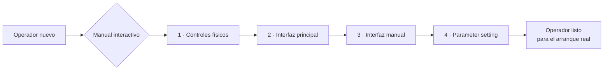

# 🏭 Manual interactivo · Alimentadora LP‑P22

**Instructivo interactivo para operar la alimentadora de la línea de postes LP‑P22, con la HMI simulada paso a paso.**

Aplicación web autocontenida que reproduce la interfaz real de la máquina y guía al operador control por control: resalta exactamente qué botón tocar en cada paso, deja practicar las interacciones clave antes de tocar el equipo real y advierte las trampas que hacen fallar o frenar la operación.

> Proyecto de trabajo estandarizado y transferencia de conocimiento. Ingeniería Industrial, operaciones y reducción de dependencia de una sola persona.

---

## 🎯 El problema

Operar la alimentadora LP‑P22 dependía de **conocimiento no documentado** que vivía en una sola persona.

La HMI está en inglés técnico mal traducido (`Back off`, `Out of the knife`, `Cessation`), con controles que se ven idénticos pero hacen cosas distintas, y un detalle que confunde a cualquiera que llega nuevo: hay una **perilla física de Manual/Automático que no funciona** y que parece ser el selector de modo. El cambio real se hace desde un botón digital en la pantalla.

Encima, algunos parámetros tienen umbrales que no están escritos en ningún lado: bajar la velocidad de alimentación por debajo de cierto valor **frena toda la operación** sin que el operador entienda por qué.

| Problema | Descripción |
|---|---|
| **Dependencia de una persona** | Solo quien ya sabía podía arrancar y operar la máquina. |
| **Interfaz confusa** | HMI en inglés técnico, con controles físicos y digitales mezclados. |
| **Trampas no documentadas** | Perilla física muerta, umbrales de velocidad que detienen la producción. |
| **Curva de aprendizaje lenta** | No existía forma segura de practicar sin arriesgar la máquina o el material. |

---

## 💡 La solución

Un **instructivo interactivo** que simula la HMI real y convierte el conocimiento tribal en trabajo estandarizado que cualquiera puede consultar y practicar.

1. El operador abre el manual en cualquier navegador; **no instala nada**.
2. Avanza por pasos con el mismo aspecto que la pantalla real de la máquina.
3. En cada paso, un **pulso rojo resalta el control exacto** que debe usar, con su explicación al lado.
4. Practica las **interacciones clave** —cambiar de modo, fijar/liberar la lámina, ajustar la longitud de alimentación— de forma segura antes de tocar el equipo.

El resultado: un operador nuevo entiende la lógica de la alimentadora y sus trampas **sin depender de que alguien esté libre para enseñarle**.

---

## 🔄 Antes / Después

Comparación cualitativa en lo que de verdad cambió. Sin métricas inventadas.

| Dimensión | Antes | Después |
|---|---|---|
| Quién podía enseñar | Una sola persona con experiencia | El manual, disponible siempre |
| Forma de aprender | Ver a alguien operar en vivo | Práctica guiada paso a paso |
| Trampas de la máquina | Se descubrían por error | Advertidas de forma explícita |
| Riesgo al practicar | Sobre la máquina real y el material | Cero: simulación en pantalla |
| Idioma / claridad | Inglés técnico sin contexto | Explicación en español, control por control |

---

## ⭐ Por qué importa

El valor no está en el diseño bonito, sino en volver la operación **transferible y a prueba de errores**:

- **Continuidad operativa:** el arranque deja de depender de una sola persona; el proceso no se detiene si alguien falta.
- **Trabajo estandarizado:** todos aprenden la misma secuencia correcta, con las mismas advertencias.
- **Reducción de errores:** las trampas conocidas (perilla muerta, umbral de velocidad) se enseñan antes de que causen un paro.
- **Onboarding más rápido:** un operador nuevo se familiariza con la HMI sin ocupar tiempo de la máquina ni de un instructor.

---

## 🔁 Cómo funciona

El manual está construido como un componente interactivo que simula las cuatro pantallas de la máquina y encadena los pasos como una guía.

| Componente | Tecnología | Rol |
|---|---|---|
| Construcción | **Claude AI** (artifact interactivo) | Genera la app guiada a partir de la HMI real |
| Interfaz y simulación | HTML + CSS (container queries) | Reproduce las pantallas Main, Manual y Parameter |
| Guía visual | Animación de resaltado (pulso) | Señala el control exacto de cada paso |
| Navegación | Máquina de estados por pasos | Sidebar, botones y flechas del teclado |
| Estilo | Design system propio (*modernist*) | Tipografía, color y componentes consistentes |

---

## 🗂️ Contenido del instructivo

Ocho pasos organizados en cuatro secciones que siguen la lógica real de operación:

- **Controles físicos** — Paro de emergencia (ON/OFF general) y la perilla Manual/Automático **que no funciona y no se debe tocar**.
- **Interfaz principal** — Selector digital Manual/Automático (aquí sí se cambia el modo, con la luz verde que confirma AUTO) y los botones de navegación entre pantallas.
- **Interfaz manual** — Servo `Forward` / `Back off` y el mecanismo de fijación `Clamping` / `Relaxation` de la lámina.
- **Parameter setting** — Longitud de alimentación (*Feed length*) y velocidad (*Feed speed*), con el umbral crítico por debajo del cual la operación se atrasa.

---

## 🚀 Instalación y uso

**Requisitos:** solo un navegador moderno (Chrome, Edge, Firefox). No requiere internet, Python ni instalación.

1. Descarga la carpeta del proyecto completa (incluye `Manual LP-P22.dc.html`, `support.js` y la carpeta `_ds/`).
2. Abre **`Manual LP-P22.dc.html`** con doble clic.
3. Navega con **Anterior / Siguiente**, con el **sidebar** o con las **flechas ← →** del teclado.
4. En los pasos interactivos, toca el control resaltado para ver cómo responde la máquina.

> Mantén los archivos juntos: el manual carga su estilo y su lógica desde `_ds/` y `support.js`. Si los separas, se abre sin formato.

---

## ⚠️ Limitaciones y mejoras futuras

- **Simulación parcial:** reproduce los controles y la lógica clave, no todos los parámetros de la HMI real. Mejora futura: cubrir la pantalla completa de *Parameter setting*.
- **Secuencia de arranque:** hoy explica cada control; el siguiente paso es encadenarlos en un **procedimiento de arranque de principio a fin** (SOP).
- **Sin registro de avance:** no guarda qué pasos ya vio el operador. Mejora futura: checklist de dominio.
- **Un solo idioma de interfaz:** las etiquetas de la máquina siguen en inglés (a propósito, para que coincidan con el equipo real); la explicación es en español.

---

## 💼 Stack

`Claude AI` · `HTML` · `CSS (container queries)` · `Design system modernist` · `HMI simulada`

---

## 👤 Autor

**Carlos G. Dumas.** Estudiante de Ingeniería Industrial, Tecnológico de Monterrey. Operaciones, manufactura, mejora de procesos y automatización operativa.

Contacto: cgarciadumas@gmail.com
