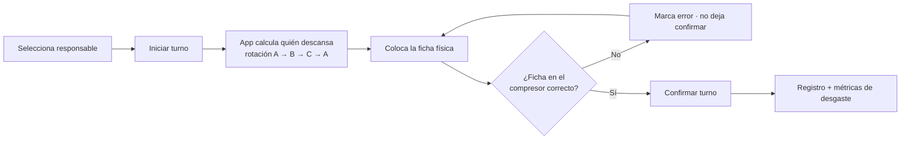

# 🔄 Poka‑Yoke de rotación de compresores · LP‑COMP‑01

**Aplicación de tablet que guía y verifica la rotación diaria de los tres compresores de aire, para que se desgasten parejo y ninguno se sobreexplote.**

Herramienta operativa con dos vistas —**operador** y **supervisor**— que le dice al operador exactamente **qué compresor debe descansar hoy**, valida que la **ficha física** quede en el correcto antes de confirmar el turno, y le da al supervisor métricas de balance de desgaste, detección de patrones malos y exportación de histórico.

> Proyecto de confiabilidad de equipos y poka‑yoke. Ingeniería Industrial, mantenimiento preventivo, gestión visual y trazabilidad.

---

## 🎯 El problema

Los tres compresores deben rotarse para que **descanse uno por turno** y todos se desgasten parejo. En la práctica, eso no pasaba.

Sin una guía clara, el operador olvida cuál toca descansar, siempre apaga el mismo o alterna entre dos (patrón "ping‑pong"). El resultado es **desgaste disparejo**: uno o dos compresores trabajan de más y fallan antes, mientras otro se usa poco. Además, no había registro de **quién** hizo el arranque ni evidencia de que la rotación se cumpliera.

| Problema | Descripción |
|---|---|
| **Rotación inconsistente** | Se apagaba "el que se acordaban", no el que tocaba. |
| **Desgaste disparejo** | Compresores sobreexplotados que fallan antes de tiempo. |
| **Patrón ping‑pong** | Alternar solo entre dos equipos deja el tercero sin uso o sobrecargado. |
| **Sin trazabilidad** | Nadie registraba quién arrancó ni qué compresor descansó. |

---

## 💡 La solución

Una **app de tablet a prueba de errores** que quita la decisión de la memoria del operador y la vuelve un paso verificado.

1. El operador selecciona **quién es el responsable** del arranque.
2. Presiona **Iniciar turno**; la app **calcula sola** qué compresor toca descansar (según el de ayer) y lo indica.
3. El operador coloca la **ficha física** en ese compresor y la marca en la app.
4. **Poka‑yoke:** si la ficha va en el equipo equivocado, la app la marca en rojo y **no deja confirmar**; solo confirma cuando está en el correcto.
5. Al **Confirmar**, se registra el turno con responsable, fecha, hora y compresor que descansó.

El supervisor ve, desde su vista, si la rotación está balanceada, cuántos errores de ficha hubo y si aparece un patrón ping‑pong, y **exporta el histórico a CSV**.

---

## 🔄 Antes / Después

Comparación cualitativa en lo que de verdad cambió. Sin métricas inventadas.

| Dimensión | Antes | Después |
|---|---|---|
| Qué compresor descansa | De memoria del operador | Lo calcula la app y lo indica |
| Error de rotación | Se descubría tarde (o nunca) | Bloqueado por el poka‑yoke de ficha |
| Responsable del arranque | No se registraba | Queda documentado por turno |
| Visibilidad del desgaste | Ninguna | Gráfica de balance + detección de ping‑pong |
| Histórico | Inexistente | Registro persistente + exportación a CSV |

---

## ⭐ Por qué importa

El valor no está en la app, sino en **alargar la vida de los equipos y quitar la decisión de la memoria**:

- **Confiabilidad de equipos:** rotación pareja = menos sobreexplotación = menos fallas prematuras.
- **Poka‑yoke real:** el turno no avanza hasta que la ficha está en el compresor correcto; el error se previene, no se corrige después.
- **Trazabilidad y responsabilidad:** cada turno queda ligado a un responsable, con fecha y hora.
- **Gestión visual para el supervisor:** balance de desgaste, errores y ping‑pong de un vistazo, sin perseguir a nadie.
- **Datos para decidir:** el CSV permite analizar tendencias y sustentar mantenimiento preventivo.

---

## 🔁 Cómo funciona

La app parte de qué compresor descansó ayer y avanza el turno de forma guiada y verificada.

| Componente | Tecnología | Rol |
|---|---|---|
| Construcción | **Claude AI** (artifact interactivo) | Genera la app de doble vista a partir de la regla de rotación |
| Interfaz | HTML + CSS (diseño limpio para tablet) | Vistas de operador y supervisor con estados por color |
| Lógica de rotación | JavaScript (componente `DCLogic`) | Calcula el descanso, valida la ficha, detecta ping‑pong |
| Persistencia | `localStorage` | Guarda histórico en la tablet; sobrevive reinicios |
| Reporte | Exportación a CSV (con BOM UTF‑8) | Histórico de turnos para análisis externo |

---

## ✨ Características

- **Cálculo automático** del compresor que debe descansar, según el del turno anterior.
- **Poka‑yoke de ficha:** no permite confirmar hasta que la ficha física está en el compresor correcto.
- **Registro por responsable:** cada turno queda ligado a quién lo arrancó.
- **Bitácora del turno en vivo**, con eventos correctos y errores marcados por color.
- **Vista supervisor** con tarjetas de métricas: turnos confirmados, errores de ficha, ping‑pong y compresor más descansado.
- **Detección de patrón ping‑pong** (rotación mal hecha entre solo dos equipos).
- **Gráfica de balance de desgaste** por días de descanso acumulados.
- **Exportación a CSV** del histórico completo.
- **Persistencia local** en la tablet; los datos sobreviven reinicios. Reinicio manual con confirmación.

---

## 🚀 Instalación y uso

**Requisitos:** una tablet o computadora con navegador moderno. No requiere internet ni instalación; es un único archivo HTML.

1. Abre **`ADF PokaYoke Compresores.html`** en la tablet.
2. En la vista **Operador**, selecciona el responsable y presiona **Iniciar turno**.
3. Coloca la ficha física donde indica la app y márcala; presiona **Confirmar** cuando esté en verde.
4. Cambia a la vista **Supervisor** para ver métricas, balance y exportar el CSV.

> Los datos se guardan en el navegador de esa tablet (localStorage). Para respaldarlos o analizarlos, usa **Exportar CSV**. Si cambias de dispositivo, el histórico no viaja solo.

---

## ⚠️ Limitaciones y mejoras futuras

- **Persistencia atada a un dispositivo:** el histórico vive en esa tablet. Mejora futura: respaldo en la nube o Google Sheets para consolidar entre turnos y equipos.
- **Rotación fija de 3 compresores:** hoy asume exactamente A, B y C. Mejora futura: parametrizar a N equipos.
- **Balance por días de descanso, no por horas reales:** no integra horómetro ni mantenimiento. Mejora futura: capturar horas de operación y ligar a un plan de TPM.
- **No cubre paros no planeados:** si un compresor falla fuera de rotación, hay que registrarlo aparte. Mejora futura: manejar excepciones.

---

## 💼 Stack

`Claude AI` · `HTML` · `CSS` · `JavaScript (DCLogic)` · `localStorage` · `Exportación CSV` · `Tablet`

---

## 👤 Autor

**Carlos G. Dumas.** Estudiante de Ingeniería Industrial, Tecnológico de Monterrey. Operaciones, manufactura, mejora de procesos y automatización operativa.

Contacto: cgarciadumas@gmail.com
